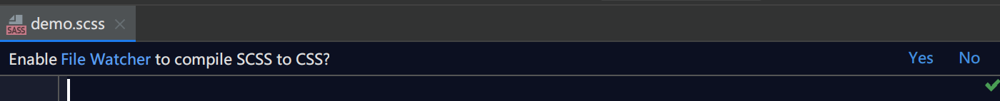

# sass 的语法格式及编译

## sass 的语法格式

原始的sass语法格式依靠严格的缩进，而我们更加建议使用 scss 语法格式来编写 sass ，它从外观上与 css 相似，更符合我们的编码习惯，例：

```scss
// demo.scss
$main-family: sans-serif;
$main-color: red;

body{
  font-family: $main-family;
  color: $main-color;
  div{
    width: 100px;
    height: 100px;
    border: 1px solid $main-color;
  }
}
```

> 对于 scss 语法下的样式，我们需要将它保存为以`.scss`为后缀的文件

上述代码使用了`$`来声明变量，对于常用的编程语言如 Python 、 JavaScript 等声明变量是是十分常见的行为，但是对于 CSS 而言却显得稀罕。上述代码中在`body`元素的花括号类包裹了另一个元素`div`，这种包裹的形式非常显式地体现了`body`是`div`父元素的关系。我们使用`$`声明的变量也在字体颜色属性`color`和`border`的颜色属性上发挥了作用，这就使得我们不必再像写 CSS 时那样不停地复制粘贴相同的属性值给不同的属性使用了。

## sass的编译

但是我光把样式写出来可不行，还需要在 HTML 中使用它， HTML 可以直接使用`<link>`元素导入 CSS 样式，但是却不能导入  sass 样式，我们如果要使用 sass 写的样式就不得不把它编译成 CSS 样式然后才能导入到 HTML 中。

以下介绍如何对 sass 进行编译的方法。

### 使用命令行编译

我们可以在命令行内敲入以下命令后回车进行编译：

```shell
sass <要编译的Sass文件路径>/style.scss:<要输出CSS文件路径>/style.css
```

例如`sass asserts/demo.scss:css/`表示将`assets`文件夹下的`demo.scss`编译成`css`文件夹下的同名称 css 文件。

对于文件下的多个文件则文件夹`/`旁的文件无需敲入，它会默认使用全部文件。

### 使用插件编译（推荐做法）

对于前端开发者，我建议使用 Jetbrains 公司的 Webstorm （收费）和微软公司的 VS code （免费），这两款开发软件都有着强大的功能和丰富的插件。

#### VS code 编译 sass 的插件

在 VS code 中我们可以在应用商店查找名为 Live Sass Compiler 的插件并进行安装使用，安装后会在 VS code 底部状态栏了出现一个 Watch Sass 的按钮，在点击它之后，它会监听你打开的文件中的 sass 或者 scss 文件，自动将它们在文件夹下编译成 css 文件，并且如果你的 scss 发生改变，它能即时进行编译。


#### Webstorm 下编译 sass

打开 webstorm ，查看是否有 File Watchers 这个工具。如果没有则需要到 Plugins 中下载。在 File Watchers 页面下点击“+”按钮增加需要监听并实时编译的文件类型。


在选择 scss 文件后，我们来到如下界面


在这个界面内需要输入 Program 的路径，这里需要选择 Ruby 安装路径下（我把 Ruby 安装了 D 盘，默认应该是在 C 盘） bin 文件夹内的 sass.bat文件的路径。


安装成功后，创建 scss 文件，会在 scss 文件内的页面上方显示是否要监听 scss 文件并实时编译，选择 Yes 就能实时编译了。



### 使用 含 GUI 页面的编译软件

以下是比较流行的软件：

1. Koala （[http://koala-app.com/](http://koala-app.com/)）
2. Compass.app（[http://compass.kkbox.com/](http://compass.kkbox.com/)）
3. Scout（[http://mhs.github.io/scout-app/](http://mhs.github.io/scout-app/)）

我并不推荐使用额外的软件去编译 sass。