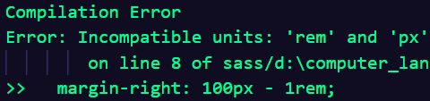

# sass 函数化

我们在之前的内容中了解到， sass 的运用使得 css 更符合计算机语言的一些特性，例如它拥有变量，混合宏的使用使开发者可以像运用函数一样来写 css 样式，这节内容我们将了解更多 sass 的知识，这些内容将使 sass 更加具有其它计算机语言的函数特性,

## sass的数值类型

sass 也是具有数值类型的，这些数值类型既有与其它计算机语言相似的地方，也有不同的地方。主要有以下这些数值类型：

* 数字，1、2...还包括10px这种的。
* 字符串，有引号字符串或者无引号字符串，例如"bar"、'foo'、!important...
* 颜色，比如说 blue、 #ccc、rab(255,255,0)。
* 布尔型，true和false。
* 空值，null
* 值列表，使用空格或者逗号分隔开的都算，如1.5em 1em 0 2em 、 Helvetica, Arial, sans-serif。
  
需要注意的是，在使用`#{}`插值语法后，有引号字符串会被编译成无引号字符串。例：

```scss
$selector:".header";
div.box #{$selector}{
  width: 100px;
  color: red;
  &::after{
    content: "";
  }
}
```

编译结果：

```css
div.box .header {
  width: 100px;
  color: red;
}

div.box .header::after {
  content: "";
}
/*# sourceMappingURL=demo1.css.map */
```

## 数值计算

sass 可以进行基本的数值运算，例：

```scss
div{
  width: 100px+200px;
  height: 100px-50px;
  margin-top: 100px*2;
  margin-bottom: (100px / 2);
  margin-left: 100px%44;
}
```

编译结果：

```css
div {
  width: 300px;
  height: 50px;
  margin-top: 200px;
  margin-bottom: 50px;
  margin-left: 12px;
}
/*# sourceMappingURL=demo2.css.map */
```

除了除法运算时，如果不加括号，除法运算符会被当成原始的斜杠`/`外，其它的运算符正常使用即可。

需要注意的是，如果运算的两个数值单位不一致会报错。

```scss
div{
  margin-right: 100px - 1rem;
}
```



另外如果在除法运算时，使用了两个带符号的变量，编译时会消除掉符号。

### 颜色值运算

颜色值可以被当成普通数值进行加减乘除上的计算，例：

```scss
div{
  color: #013126 + #013000;
  color: #123000 * 2;
  color: #cccccc - #c00000;
  color: (#cccccc / 2);
}
```

编译结果：

```css
div {
  color: #026126;
  color: #246000;
  color: #0ccccc;
  color: #666666;
}
/*# sourceMappingURL=demo4.css.map */
```

## 变量运算

除了数值运算外，sass 也允许我们使用变量进行运算，例：

```scss
$base-width: 200px;
$length: 100px;

.header{
  width: $base-width - $length;
}
```

编译结果：

```css
.header {
  width: 100px;
}
/*# sourceMappingURL=demo3.css.map */
```

需要注意的是，需要注意代码的规范，运算符需要与变量名至少保持一个空格以上的距离，在这里如果不规范会把减号当成连接符`-`。

## sass 的控制命令

### @if

对其它计算机语言而言，`if...else...`是比较常见的条件控制语句，sass 的`@if`也具有相同的作用，并且可以与`@else`和`@else if`配合使用。

```scss
@mixin easySheet($length) {
  @if($length > 100px){
    width: $length;
    color: red;
  }
  @else if($length > 50px){
    width: 75px;
    color: yellow;
  }
  @else{
    width: 50px;
    color: blue;
  }
}

.header{
  @include easySheet(200px);
  .box{
    @include easySheet(60px);
    .box1{
      @include easySheet(20px);
    }
  }
}
```

编译结果：

```css
.header {
  width: 200px;
  color: red;
}

.header .box {
  width: 75px;
  color: yellow;
}

.header .box .box1 {
  width: 50px;
  color: blue;
}
/*# sourceMappingURL=demo5.css.map */
```

